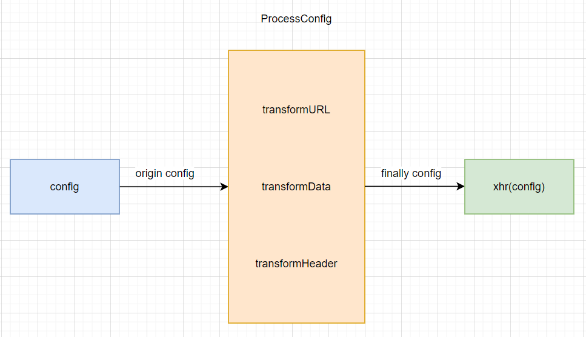

# 处理请求URL参数



## 需求分析

之前我们有个例子，还没有解决，在这里我们着重看一下。

```typescript
axios({
  method: 'get',
  url: '/base/get',
  params: {
    a: 1,
    b: 2
  }
});
```

我们希望上方的例子最后能帮我们拼接成`/base/get?a=1&b=2`。实际上就是我们把`params`对象的`key`和`value`拼接到`url`上。

这里，我们得考虑多种情况。

### 参数为数组

```typescript
axios({
  method: 'get',
  url: '/base/get',
  params: {
    foo: ['bar', 'baz']
  }
});
```

最终请求的`url`是`/base/get?foo[]=bar&foo[]=baz`.

### 参数为对象

```typescript
axios({
  method: 'get',
  url: '/base/get',
  params: {
    foo: {
      bar: 'baz'
    }
  }
});
```

最终请求的 url 是 /base/get?foo=%7B%22bar%22:%22baz%22%7D，foo 后面拼接的是 {"bar":"baz"} encode 后的结果。

### 参数值为 Date 类型

```typescript
const date = new Date()

axios({
  method: 'get',
  url: '/base/get',
  params: {
    date
  }
});
```

最终请求的 url 是 /base/get?date=2019-04-01T05:55:39.030Z，date 后面拼接的是 date.toISOString() 的结果。

### 特殊字符支持

对于字符 @、:、$、,、、[、]，我们是允许出现在 url 中的，不希望被 encode。

```typescript
axios({
  method: 'get',
  url: '/base/get',
  params: {
    foo: '@:$, '
  }
});
```

最终请求的 url 是 `/base/get?foo=@:$+`，注意，我们会把空格 转换成 +。

### 空值忽略

对于值为 null 或者 undefined 的属性，我们是不会添加到 url 参数中的。

```typescript
axios({
  method: 'get',
  url: '/base/get',
  params: {
    foo: 'bar',
    baz: null
  }
});
```

最终请求的 url 是 `/base/get?foo=bar`。

### 丢弃 url 中的哈希标记
```typescript
axios({
  method: 'get',
  url: '/base/get#hash',
  params: {
    foo: 'bar'
  }
});
```

最终请求的 url 是 `/base/get?foo=bar`

### 保留 url 中已存在的参数

```typescript
axios({
  method: 'get',
  url: '/base/get?foo=bar',
  params: {
    bar: 'baz'
  }
})
```

最终请求的 url 是 `/base/get?foo=bar&bar=baz`

## buildURL 函数的实现

根据我们的一个需求分析，我们只需要实现一个工具函数，根据`params`中对应的`value`类型，来进行拼接。在这里，我们将这种工具函数进行单独的管理，于是我们创建一个 helpers 目录，在这个目录下创建 url.ts 文件，未来会把处理 url 相关的工具函数都放在该文件中。

`helpers/url.ts`

```ts
import { isDate, isObject } from './utils';

const ENCODE_MAP: Record<string, string> = {
  "%40": "@",
  "%3A": ':',
  "%24": "$",
  "%2C": ",",
  "%20": "+",
  "%5B": "[",
  "%5D": "]"
};

/**
 * 自定义的encode方法，ENCODE_MAP中的字符不进行encode
 * @param val string 
 * @returns string
 */
function encode(val: string): string {
  return Object.keys(ENCODE_MAP).reduce((prev, curr) => {
    return prev.replace(new RegExp(curr, 'gi'), ENCODE_MAP[curr]);
  }, encodeURIComponent(val));
}

/**
 * 根据 url 和 params 拼接构造最终的url
 * @param url 
 * @param params 
 * @returns 
 */
export function buildURL(url: string, params?: Record<string, any>): string {
  if (!params) {
    return url;
  }

  const parts: string[] = [];

  Object.keys(params).forEach(key => {
    const originalVal = params[key];
    if (originalVal === null || originalVal === undefined) {
      return;
    }
    let values: any[] = [];
    if (Array.isArray(originalVal)) {
      values = originalVal;
      key += '[]'
    } else {
      values = [originalVal];
    }
    values.forEach(val => {
      if (isDate(val)) {
        val = val.toISOString();
      } else if (isObject(val)) {
        val = JSON.stringify(val);
      }
      parts.push(`${encode(key)}=${encode(val)}`);
    })
  });
 
  let serializedParams = parts.join('&');

  if (serializedParams) {
    const hashIndex = url.indexOf('#');
    if (hashIndex !== -1) {
      url = url.slice(0, hashIndex);
    }
    url += (url.indexOf('?') === -1 ? '?' : '&') + serializedParams;
  }

  return url;
}
```

`helpers/utils.ts`
```typescript
const toString = Object.prototype.toString;

export function isDate(val: any): val is Date {
  return toString.call(val) === '[object Date]';
}

export function isObject(val: any): val is Object {
  return val && (typeof val === 'object');
}
```

## 实现URL参数处理逻辑

我们已经实现`buildURL`函数，接下来我们用他实现`url`参数的处理逻辑。

在`index.ts`文件中填写代码：

```typescript
function axios(config: AxiosRequestConfig) {
  // TODO:
  processConfig(config);
  xhr(config);
}

function processConfig(config: AxiosRequestConfig): void {
  config.url = transformURL(config);
}

function transformURL(config: AxiosRequestConfig): string {
  const { url, params } = config;
  return buildURL(url, params);
}
```

在这里，我们在执行`xhr`函数之前,会先执行`processConfig`进行处理。目前只对了url进行了处理，未来会处理其他属性。
