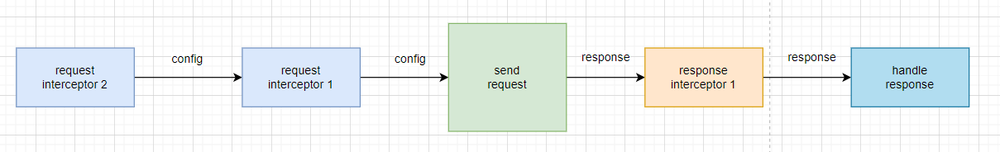

# 拦截器的设计和实现

在`axios`的使用中，我们都应该用过[`interceptors`](https://axios-http.com/zh/docs/interceptors)为我们的`响应`或`请求`进行处理。

We can intercept requests or responses before they are handled by `then` or `catch`.

```ts
// Add a request interceptor
axios.interceptors.request.use(function (config) {
    // Do something before request is sent
    return config;
  }, function (error) {
    // Do something with request error
    return Promise.reject(error);
  });

// Add a response interceptor
axios.interceptors.response.use(function (response) {
    // Any status code that lie within the range of 2xx cause this function to trigger
    // Do something with response data
    return response;
  }, function (error) {
    // Any status codes that falls outside the range of 2xx cause this function to trigger
    // Do something with response error
    return Promise.reject(error);
  });
```

If you need to remove an interceptor later you can.

```typescript
const myInterceptor = axios.interceptors.request.use(function () {/*...*/});

axios.interceptors.request.eject(myInterceptor);
```

You can add interceptors to a custom instance of axios.

```ts
const instance = axios.create();
instance.interceptors.request.use(function () {/*...*/});
```

## 整体设计

拦截器的工作流程如下图所示。



整个过程是一个链式调用的方式，每个拦截器支持`同步`，`异步`操作。（这里我们使用`Promise`）。

在这个`Promise`链的过程中，请求拦截器`resolve`函数处理的是`config`对象，而响应拦截器`resolve`函数处理的是`response`对象。

根据`axios`的用法我们可以知道，`axios`上具有`interceptors`属性，里面有`request`和`response`分别对应管理`请求拦截器`和`响应拦截器`。

这里的话，我们需要去创建拦截器管理类，允许我们去添加和删除以及遍历拦截器。

## 拦截器管理类的实现

根据需求,`axios`上的`interceptors`属性，里面有`request`和`response`分别对应管理`请求拦截器`和`响应拦截器`，都提供了一个`use`方法来添加拦截器。`use`方法支持两个参数，一个是`resolve`函数，一个是`reject`函数。

对于`resolve`的函数参数：
- 请求拦截器是`AxiosRequestConfig`类型
- 响应拦截器是`AxiosResponse`类型

对于`reject`函数参数类型都是`any`类型。

###  接口定义

```ts
export interface AxiosInterceptorManager<T> {
  use(resolved: ResolveFn<T>, rejected: RejectedFn): void;
}

export interface ResolveFn<T> {
  (val: T): T| Promise<T>;
}

export interface RejectedFn {
  (val: any): any;
}
```

这里我们定义了`AxiosInterceptorManager`泛型接口，因为`请求拦截器`和`响应拦截器`的`resolved`是不同的。

### 代码实现

```ts
import { RejectedFn, ResolveFn } from '../types';

interface Interceptor<T> {
  resolved: ResolveFn<T>;
  rejected?: RejectedFn;
}

export default class InterceptorManager<T> {
  private interceptors: Array<Interceptor<T> | null>;

  constructor() {
    this.interceptors = [];
  }

  use(resolved: ResolveFn<T>, rejected?: RejectedFn): number {
    const interceptor: Interceptor<T> = {
      resolved,
      rejected
    };
    this.interceptors.push(interceptor);
    return this.interceptors.length - 1;
  }

  forEach(fn: (interceptor: Interceptor<T>, index?: number) => void): void {
    this.interceptors.forEach((interceptor, index) => {
      if (interceptor !== null) {
        fn(interceptor, index);
      }
    });
  }

  eject(id: number): void {
    if (this.interceptors[id]) {
      this.interceptors[id] = null;
    }
  }
}
```

在这里，我们定义了一个`InterceptorManager`泛型类，内部维护了一个私有属性`interceptors`, 它是一个数组，用来存储`拦截器`，并提供3个方法。

- `use` 用于添加拦截器到`interceptors`中去，并放回一个唯一标识`id`.
- `forEach`接口就是遍历`interceptors`用的，它支持传入一个函数，遍历过程中会调用这个函数，并把`interceptors`中的每一个`interceptor`作为函数参数。
- `eject`就是删除一个拦截器。通过`id`进行删除。


## 链式调用实现

当我们实现号拦截器管理类，接下来就是在`Axios`中管理号`interceptors`属性。类型如下。

```ts
interface Interceptors {
  request: InterceptorManage<AxiosRequestConfig>;
  response: InterceptorManage<AxiosResponse>;
}

export default class Axios {
  interceptors: Interceptors;

  constructor() {
    this.interceptors = {
      request: new InterceptorManager<AxiosRequestConfig>(),
      response: new InterceptorManager<AxiosResponse>()
    };
  }
}
```

`Interceptors`类型中有2个属性
- 请求拦截器管理实例
- 响应拦截器管理实例

接下来，我们修改`request`方法的逻辑，添加拦截器链式调用的逻辑。

`core/Axios.ts`

```ts
interface PromiseChain {
  resolved: ResolvedFn | ((config: AxiosRequestConfig) => AxiosPromise);
  response?: RejectedFn;
}

request(url: any, config?: any): AxiosPromise {
  if (typeof url === 'string') {
    if (!config) {
      config = {};
    }
    config.url = url;
  } else {
    config = url;
  }

  const chain: PromiseChain[] = [{
    resolved: dispatchRequest,
    rejected: undefined
  }];

  this.interceptors.request.forEach(interceptor => {
    chain.unshift(interceptor);
  });

  this.interceptors.response.forEach(interceptor => {
    chain.push(interceptor);
  });

  let promise = Promise.resolve(config);

  while (chain.length) {
    const { resolved, rejected } = chain.shift()!;
    promise = promise.then(resolved, rejected);
  }

  return promise;
}
```

首先，构造一个 `PromiseChain` 类型的数组 `chain`，并把 `dispatchRequest` 函数赋值给 `resolved` 属性；接着先遍历请求拦截器插入到 `chain` 的前面；然后再遍历响应拦截器插入到 `chain` 后面。

接下来定义一个已经 `resolve` 的 `promise`，循环这个 `chain`，拿到每个拦截器对象，把它们的 `resolved` 函数和 `rejected` 函数添加到 `promise.then` 的参数中，这样就相当于通过 `Promise` 的链式调用方式，实现了拦截器一层层的链式调用的效果。

注意我们拦截器的执行顺序，对于请求拦截器，先执行后添加的，再执行先添加的；而对于响应拦截器，先执行先添加的，后执行后添加的。